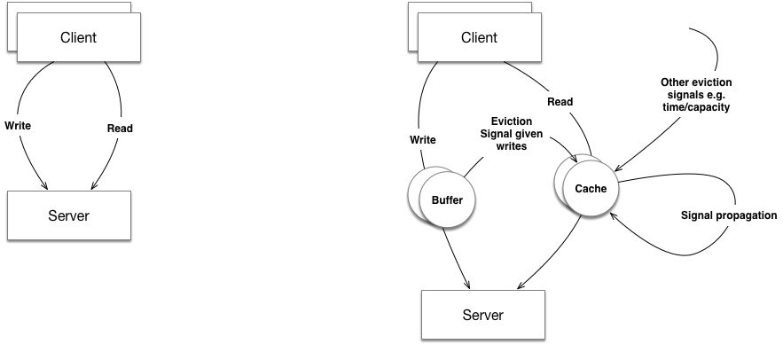

# fake-news #

Welcome to fake-news! Fake news provides a means of modelling and simulating a system using
Akka Typed actors and Akka Streams.

## What are we modelling?

The following diagram shows what we are modelling. On the left we have the simplest of client/server
scenario. On the right, we have a typical architecture that permits greater scale:

## How do we express the model?

The system model is expressed as streams and actors. You can express anything you want in terms of 
behaviour.

## How do we run the model?

The model is run by having the program provide each actor with a time in relation to the start of 
the system. Actors can transition to a behaviour in relation to where they are in simulation time.

## How do we visualise the results?

Open Tracing is intended to be used to capture the results. This remains an exercise for the reader.

## Contribution policy ##

Contributions via GitHub pull requests are gladly accepted from their original author. Along with
any pull requests, please state that the contribution is your original work and that you license
the work to the project under the project's open source license. Whether or not you state this
explicitly, by submitting any copyrighted material via pull request, email, or other means you
agree to license the material under the project's open source license and warrant that you have the
legal authority to do so.

## License ##

This code is open source software licensed under the
[Apache-2.0](http://www.apache.org/licenses/LICENSE-2.0) license.
